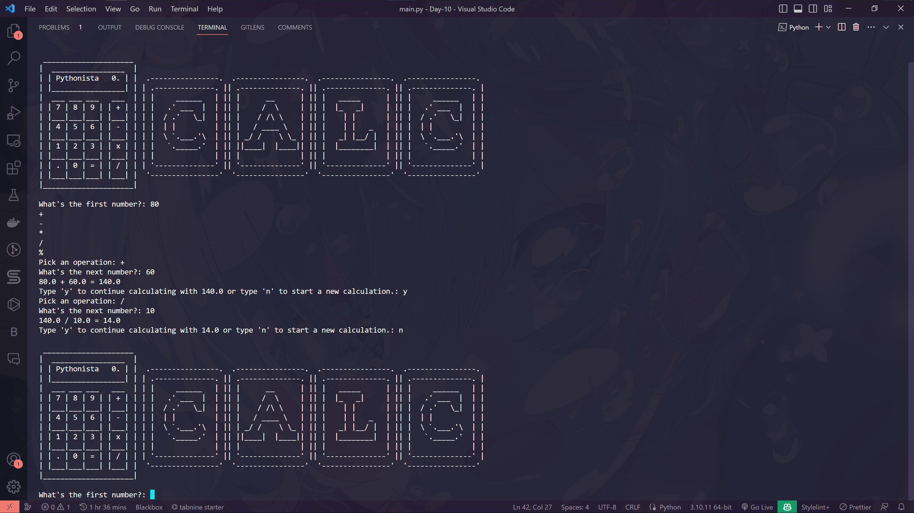

# Calculator app

The Calculator App is a Python program that performs basic arithmetic operations. It allows users to add, subtract, multiply, divide, and calculate percentages.

# Usage

1. Run the program in a Python environment.
2. The program will display the calculator logo.
3. Enter the first number when prompted.
4. Choose an operation by typing the corresponding symbol (+, -, \*, /, %).
5. Enter the second number.
6. The program will display the result of the calculation.
7. To continue calculating with the result, type 'y' and press Enter. To start a new calculation, type 'n' and press Enter.
8. If you choose to continue calculating, the result will become the first number for the next operation.
9. Use Ctrl + C to exit the program.

## Preview

Feel free to explore and perform calculations using this Calculator App!
