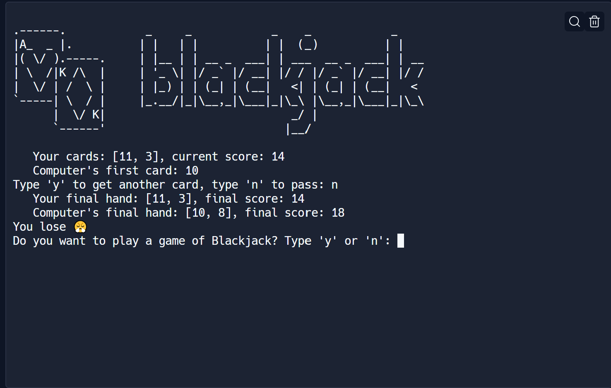

# Blackjark Game / 21

The Blackjack Game, also known as 21, is a Python module that allows you to play a game of blackjack against the computer.

## How to Play

1. The game starts with two cards dealt to the player and the computer.
2. The player's cards and the computer's first card are displayed.
3. The player can choose to either get another card or pass.
4. If the player's score reaches 21, the player wins with a blackjack.
5. If the player's score goes over 21, the player loses.
6. If the player passes, the computer starts drawing cards until it reaches a score of 17 or higher.
7. The final hands and scores are displayed, and the winner is determined based on the scores.

## Features

- Random card dealing
- Calculation of scores
- Comparison of scores to determine the winner
- Interactive gameplay

## Getting Started

To play the Blackjack Game, follow these steps:

1. Clone the repository: `git clone <repository-url>`
2. Navigate to the project directory: `cd blackjack-game`
3. Run the game: `python main.py`

## Requirements

- Python 3.x
- art library

## Acknowledgments

This game was developed as part of the Python programming exercises and combines various programming concepts and techniques.

## Preview

Enjoy playing Blackjack and have fun!
