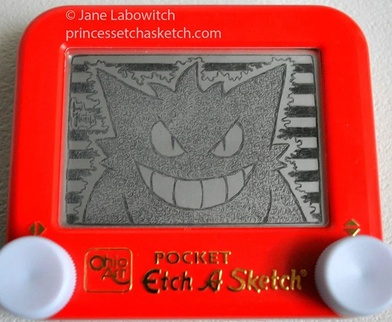

# Etch A Sketch App

This Python program implements an "Etch A Sketch" app using the Turtle graphics library. It allows you to draw and create artwork using keyboard inputs. The program uses higher-order functions and event listeners to respond to user actions.

## How to Use

1. Run the program.
2. A turtle drawing window will appear.
3. Use the following keyboard inputs to control the turtle:
   - **W**: Move the turtle forward.
   - **S**: Move the turtle backward.
   - **A**: Turn the turtle left.
   - **D**: Turn the turtle right.
   - **C**: Clear the drawing and reset the turtle's position.
4. Experiment with different key combinations to create your artwork!

## Code Explanation

The program uses the `Turtle` class from the `turtle` module to create a turtle object named `t`. It also creates a `Screen` object named `screen` to listen for keyboard events.

The program defines several functions to control the turtle's movements:

- `move_forwards()`: Moves the turtle forward by 10 units.
- `move_backwards()`: Moves the turtle backward by 10 units.
- `turn_left()`: Turns the turtle left by 10 degrees.
- `turn_right()`: Turns the turtle right by 10 degrees.
- `clear()`: Clears the drawing and resets the turtle's position.

The `screen` object listens for specific key presses and associates them with the corresponding functions. For example, pressing the 'W' key triggers the `move_forwards()` function.

The `screen.exitonclick()` method ensures that the program exits when the screen is clicked.

## Further Customization

Feel free to modify the code to change the turtle's movements, adjust the drawing speed, or add additional features to the app.

Happy drawing!
