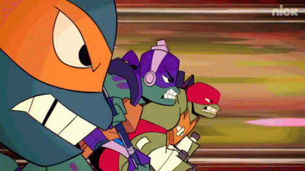

# Turtle Race



Welcome to the Turtle Race! This Python program simulates a fun race between colorful turtles using the Turtle graphics library. Place your bet on the winning turtle and see if you can predict the outcome!

## How to Run the Program

1. Make sure you have Python installed on your computer.
2. Download the source code files.
3. Open the terminal/command prompt and navigate to the directory where the files are saved.
4. Run the following command to execute the program:

   ```python
   python main.py
   ```

5. The turtle race window will appear on the screen.

## How to Play

1. Before the race starts, you will be prompted to make your bet. Enter the color of the turtle you think will win the race.
2. Six colorful turtles will line up at the starting position.
3. Once you've placed your bet, the race will begin!
4. Each turtle will move forward a random distance in each round.
5. The race continues until one of the turtles reaches the finish line (x-coordinate of 230).
6. If the winning turtle matches your bet, congratulations! You've won the race!
7. If the winning turtle doesn't match your bet, don't worry! You can try again and test your luck.

## Customize the Race

Feel free to customize the program to enhance your racing experience. You can modify the following aspects:

- Colors: Add or change the colors of the turtles by editing the `colors` list.
- Bet Input: Adjust the prompt message or validation for the user's bet input.
- Race Distance: Modify the race distance by changing the `x-coordinate` value in the race condition.

Enjoy the excitement of the Turtle Race and have fun!

## Requirements

- Python 3.x
- Turtle graphics library
