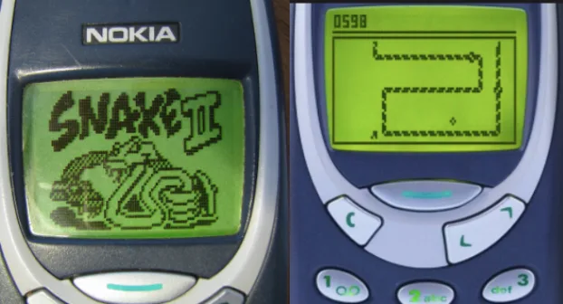

# Snake Game


Welcome to the Snake Game! This is a classic arcade game where you control a snake and aim to eat food to grow longer. The objective is to achieve the highest possible score without colliding with the boundaries, yourself, or the snake's tail.

## How to Play

1. Clone the repository to your local machine.
2. Make sure you have Python and the Turtle graphics library installed.
3. Open a terminal or command prompt and navigate to the project directory.
4. Run the following command to start the game:
   ```
   python main.py
   ```

## Game Controls

- Use the arrow keys (Up, Down, Left, Right) on your keyboard to control the snake's movement.
- Eat the food (blue circle) to increase your score and the length of the snake.
- Avoid colliding with the boundaries of the game screen, yourself, or the snake's tail.

## Code Structure

The game consists of the following Python files:

- `main.py`: Contains the main game loop and setup code for the screen, snake, food, and scoreboard.
- `snake.py`: Defines the `Snake` class responsible for creating and managing the snake's behavior.
- `food.py`: Defines the `Food` class responsible for creating and refreshing the food item.
- `score_board.py`: Defines the `Scoreboard` class responsible for keeping track of the score and displaying it on the screen.
- `data.txt`: Where high score is saved.

Feel free to explore the code files for more details on how the game is implemented.

## Dependencies

The Snake Game requires the following dependencies:

- Python 3.x
- Turtle graphics library

Please ensure you have these dependencies installed before running the game.

## Enjoy the Game!

Have fun playing the Snake Game and aim for the highest score! If you encounter any issues or have suggestions for improvements, feel free to open an issue or contribute to the project.

Happy gaming!
