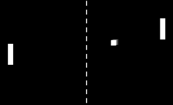

# Pong - The Arcade Game



Welcome to Pong, the famous arcade game! This is a two-player game where each player controls a paddle and aims to hit the ball past their opponent's paddle. The objective is to score points by successfully hitting the ball and prevent your opponent from doing the same.

## How to Play

1. Clone the repository to your local machine.
2. Make sure you have Python and the Turtle graphics library installed.
3. Open a terminal or command prompt and navigate to the project directory.
4. Run the following command to start the game:
   ```python
   python main.py
   ```

## Game Controls

- Right Paddle:
- Move Up: Press the "Up" arrow key
- Move Down: Press the "Down" arrow key

- Left Paddle:
- Move Up: Press the "w" key
- Move Down: Press the "s" key

## Game Rules

- The game is played on an 800x600 pixel screen.
- Each player controls a paddle on their side of the screen.
- The ball starts in the center and moves towards one of the players.
- Players must use their paddles to hit the ball and prevent it from passing them.
- If the ball passes a player's paddle, the opposing player scores a point.
- The game continues until one player reaches the winning score.
- The ball's speed increases with each successful hit.

## Code Structure

The game consists of the following Python files:

- `main.py`: Contains the main game loop and setup code for the screen, paddles, ball, and scoreboard.
- `paddle.py`: Defines the `Paddle` class responsible for creating and managing the paddles' movement.
- `ball.py`: Defines the `Ball` class responsible for creating and managing the ball's movement and interactions.
- `scoreboard.py`: Defines the `Scoreboard` class responsible for keeping track of each player's score and displaying it on the screen.

Feel free to explore the code files for more details on how the game is implemented.

## Dependencies

The Pong game requires the following dependencies:

- Python 3.x
- Turtle graphics library

Please ensure you have these dependencies installed before running the game.

## Enjoy the Game!

Have a great time playing Pong and compete with your friends to see who can score the most points! If you encounter any issues or have suggestions for improvements, feel free to open an issue or contribute to the project.

Let the Pong matches begin!
