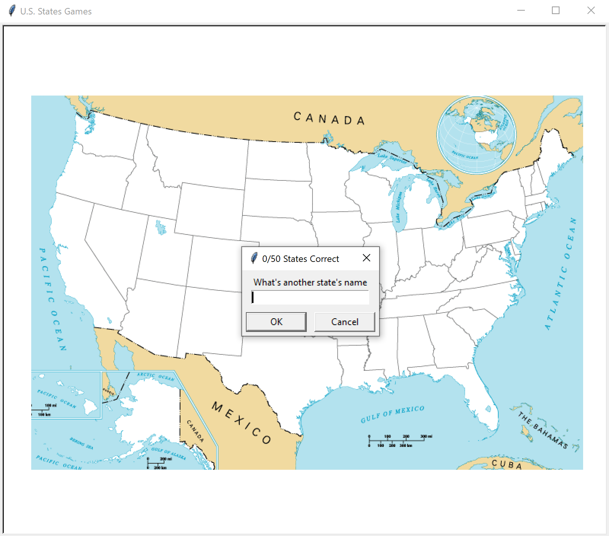

# U.S. States Guessing Game

This repository contains a Python script for a U.S. States Guessing Game. The game utilizes the `turtle` and `pandas` libraries to create an interactive map of the United States. The code is organized as follows:

## Files

- `main.py`: The main Python script that runs the U.S. States Guessing Game.
- `blank_states_img.gif`: An image file representing a blank map of the United States.
- `50_states.csv`: A CSV file containing the coordinates and names of all 50 U.S. states.
- `states_to_learn.csv`: A CSV file that will be generated by the game, containing the names of the states that the player failed to guess.

## U.S. States Guessing Game

The code in `main.py` allows users to guess the names of the 50 U.S. states. It performs the following tasks:

1. Sets up the game window and loads the blank map of the United States as the background image.
2. Reads the state data from the `50_states.csv` file using the `pandas` library.
3. Presents the player with a prompt to enter the name of a U.S. state.
4. If the player enters the name of a state correctly, the state is marked on the map and its name is displayed.
5. The game continues until the player guesses all 50 states or chooses to exit the game.
6. If the player exits the game, the names of the states they failed to guess are saved in the `states_to_learn.csv` file.

Please note that the `50_states.csv file` contains the coordinates and names of the states. You can modify this file or replace it with your own data to customize the game.

## Requirements

- Python 3.x
- Turtle graphics library
- Pandas library

To play the U.S. States Guessing Game, run the `main.py` script and follow the on-screen instructions. Have fun exploring the map and testing your knowledge of U.S. states!

Feel free to customize the game or add new features to enhance the game play experience. Enjoy!
