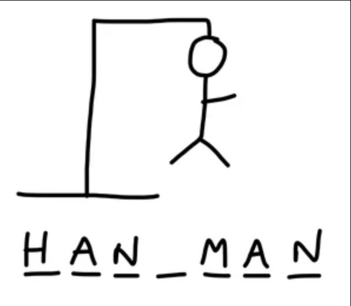

# Hangman

Welcome to the game of Hangman! In this game, you will try to guess a hidden word by suggesting letters one at a time. For each incorrect guess, a part of the hangman's body will be drawn. You have six lives to guess the word correctly before the hangman is complete. Read more about [hangman here](<https://en.wikipedia.org/wiki/Hangman_(game)>).

## How to Play

1. Run the Python script to start the game.
2. A random word will be chosen for you from a predefined list.
3. The word will be displayed as blank spaces representing each letter.
4. Enter a letter as your guess.
5. If the letter is in the word, the blank spaces will be replaced with the correct letter in their respective positions.
6. If the letter is not in the word, you will lose a life and a part of the hangman's body will be drawn.
7. Keep guessing letters until you either guess the word correctly or lose all your lives.
8. If you guess the word correctly, you win the game. Otherwise, you lose.

## Game Dependencies

This game uses the following dependencies:

- `random`: to choose a random word from the word list.
- `hangman_words`: a custom module that provides the word list for the game.
- `hangman_art`: a custom module that provides ASCII art for the hangman and game logo.

Make sure to have these dependencies installed or included in your project directory before running the game.

## How to Customize the Game

You can customize the game by modifying the word list in the hangman_words.py file. Simply add or remove words from the list to change the pool of words that can be chosen in the game.

## Example Output

Here's an example output of the game:

```less
  _ _ _ _
Guess a letter: a
_ a _ _ _
Guess a letter: e
_ a _ _ _
Guess a letter: i
_ a _ _ _
Guess a letter: o
_ a _ _ _
Guess a letter: u
_ a _ _ _
Guess a letter: r
_ a r _ _
Guess a letter: t
_ a r t _
Guess a letter: s
_ a r t s
You win.

```

## Have Fun!

Now that you have an overview of the game, feel free to give it a try and have fun guessing the hidden words. Good luck!


